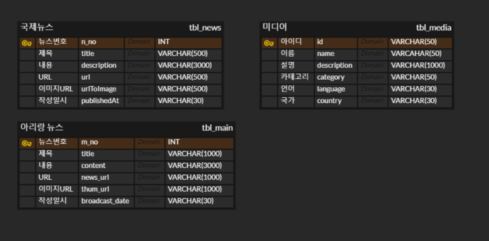

# 프로젝트 소개

## 국제 뉴스 사이트

- https://newsapi.org/ 의 API를 활용하여 국제뉴스를 제공 받고, Googl Cloud Translation 을 활용하여 번역하여 보여주는 사이트

- 개발 기간 : 2024-09-23 ~ 2024-10-08

- 기술스택 : Spring MVC, MySQL, VSCode

- 사용 API : https://newsapi.org/ (뉴스), Googl Cloud Translation (번역) , 공공데이터 포털 - 국제방송교류재단\_뉴스기사API (메인화면 뉴스)

## 프로젝트 설정

- project maven update

- com.callor.news.confing 폴더에 APIConfig 클래스를 만들고 google cloud 와 newsapi 사이트에서 받은 API KEY 설정

- db-context.xml 파일의 BasicDataSource bean 에서 DB 설정 및 MySQL 로 테이블 생성하기

## 프로젝트 기능

- 최신 뉴스 불러오기 - 공공데이터 포털의 국제방송교류재단\_뉴스기사API, 번역 API 를 활용하여 아리랑 뉴스 기사들을 메인 화면에 출력

- 국가별 헤드라인 뉴스 - 뉴스 API 를 활용해 국가별로 헤드라인 뉴스들을 불러와서 사용

- 뉴스 검색 - 뉴스 API 와 번역 API 를 활용해 검색어를 번역하여 뉴스 API 로 검색하고 받아온 값을 다시 번역하여 화면에 출력

- 미디어 소개
